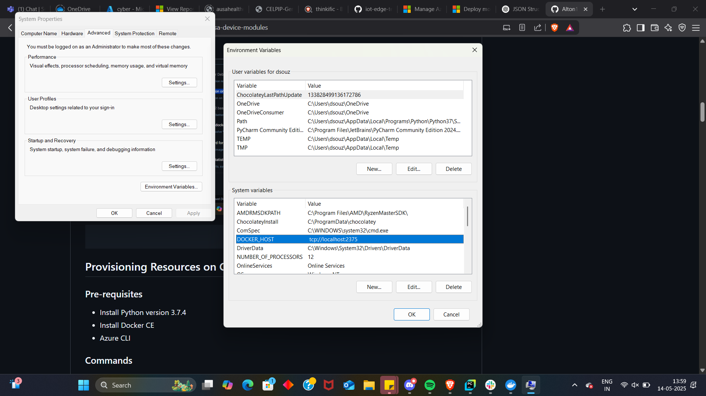

# ausa-device-modules
## Overview
This repository has a collection of ausa device modules
You can run this against a simulator or an actual device.

## Flutter Module

### Building Broker

```commandline
cd flutter_module
cd broker
docker build -t ausahealthcontainerregistry1.azurecr.io/flutter_broker:0.0.2 .
docker push ausahealthcontainerregistry1.azurecr.io/flutter_broker:0.0.2
```

### Building Subscriber
```commandline
cd flutter_module
cd subscriber
docker build -t ausahealthcontainerregistry1.azurecr.io/flutter_subscriber:0.0.2 .
docker push ausahealthcontainerregistry1.azurecr.io/flutter_subscriber:0.0.2
```

### Running the flutter module locally

```commandline
cd flutter_module
docker-compose up -d
```

## Architecture
We are using terraform to automatically provision our resources


## Setup with Iot Edge Simulator
### Pre-requisites  
1. Create an IoT Hub
2. Create a device with symmetric key 

### Configure IoT Hub in Azure Portal
1. Go to the **Azure Portal**
2. Navigate to **IoT Hub** > **Device Management** > **Devices**
3. Click on **Add Device**
4. Choose **Symmetric Keys**, check **IoT Edge Device**, and provide a **Device ID**
5. Click **Save**
6. Copy the **Primary and Secondary Connection Strings** and store them safely

### Installing IoTEdgeHubDev

```commandline
cd manifests
pip install -r requirements.txt
```
Do the following for Windows



```commandline
iotedgehubdev setup -c "<edge-device-connection-string>"
iotedgehubdev start -d .\deployment.amd64.json    
```

## Provisioning Resources on Cloud with Terraform

### Pre-requisites
 - Install Python version 3.7.4
 - Install Docker CE
 - Azure CLI
### Commands


## Setup an IoT Edge Device

### Pre-requisites
- Install Raspbian OS - [tutorial 1](https://www.tomshardware.com/how-to/set-up-raspberry-pi), [tutorial 2](https://www.pitunnel.com/doc/access-vnc-remote-desktop-raspberry-pi-over-internet)

### Setup
```commandline
curl https://packages.microsoft.com/config/debian/12/packages-microsoft-prod.deb > ./packages-microsoft-prod.deb
sudo apt install ./packages-microsoft-prod.deb
sudo apt-get update
sudo apt-get install moby-engine moby-cli
```

#### Restarting Docker

Open the daemon file
```commandline
sudo nano /etc/docker/daemon.json
```
```json
{
      "log-driver": "local"
}
```
Close the file up
```commandline
sudo systemctl restart docker
```
Installing IoT Edge Runtime
```commandline
sudo apt-get update
sudo apt-get install aziot-edge
```
Open the config file
```commandline
sudo nano /etc/aziot/config.toml
```

Add the following config:
```commandline
# DPS provisioning with X.509 certificate
[provisioning]
source = "dps"
global_endpoint = "https://global.azure-devices-provisioning.net"
id_scope = "SCOPE_ID_HERE"

# Uncomment to send a custom payload during DPS registration
# payload = { uri = "PATH_TO_JSON_FILE" }

[provisioning.attestation]
method = "x509"
registration_id = "REGISTRATION_ID_HERE"

identity_cert = "DEVICE_IDENTITY_CERTIFICATE_HERE" # For example, "file:///var/aziot/device-id.pem"
identity_pk = "DEVICE_IDENTITY_PRIVATE_KEY_HERE"   # For example, "file:///var/aziot/device-id.key"

# auto_reprovisioning_mode = Dynamic
```
Applying the config
```commandline
sudo iotedge config apply
```
Verifying installation
```commandline
sudo iotedge system status
```
```commandline
sudo iotedge system logs
```
```commandline
sudo iotedge list
```
## Generating Certificates

We need 3 certificates 

1. Root Certificate: The root certificate is used by Device Provisioning Service. This allows for automatic registration of devices with IoT hub.
2. Intermediate Certificate: It is used to sign certificates for a particular organization.
3. Device Certificate: This is a certificate for a device. 

These certificates form a chain signin each other. We will be using X.509 certificates for authentication

### Generating Root Certificates
Creating the Root Certificate configuration.

#### Step 1: Create `openssl_root_ca.cnf` file
Create `openssl_root_ca.cnf` and add the following content
```
# OpenSSL root CA configuration file.

[ ca ]
default_ca = CA_default

[ CA_default ]
# Directory and file locations.
dir               = .
certs             = $dir/certs
crl_dir           = $dir/crl
new_certs_dir     = $dir/newcerts
database          = $dir/index.txt
serial            = $dir/serial
RANDFILE          = $dir/private/.rand

# The root key and root certificate.
private_key       = $dir/private/azure-iot-test-only.root.ca.key.pem
certificate       = $dir/certs/azure-iot-test-only.root.ca.cert.pem

# For certificate revocation lists.
crlnumber         = $dir/crlnumber
crl               = $dir/crl/azure-iot-test-only.intermediate.crl.pem
crl_extensions    = crl_ext
default_crl_days  = 30

# SHA-1 is deprecated, so use SHA-2 instead.
default_md        = sha256

name_opt          = ca_default
cert_opt          = ca_default
default_days      = 375
preserve          = no
policy            = policy_loose

[ policy_strict ]
# The root CA should only sign intermediate certificates that match.
countryName             = optional
stateOrProvinceName     = optional
organizationName        = optional
organizationalUnitName  = optional
commonName              = supplied
emailAddress            = optional

[ policy_loose ]
# Allow the intermediate CA to sign a more diverse range of certificates.
countryName             = optional
stateOrProvinceName     = optional
localityName            = optional
organizationName        = optional
organizationalUnitName  = optional
commonName              = supplied
emailAddress            = optional

[ req ]
default_bits        = 2048
distinguished_name  = req_distinguished_name
string_mask         = utf8only

# SHA-1 is deprecated, so use SHA-2 instead.
default_md          = sha256

# Extension to add when the -x509 option is used.
x509_extensions     = v3_ca

[ req_distinguished_name ]
# See <https://en.wikipedia.org/wiki/Certificate_signing_request>.
countryName                     = Country Name (2 letter code)
stateOrProvinceName             = State or Province Name
localityName                    = Locality Name
0.organizationName              = Organization Name
organizationalUnitName          = Organizational Unit Name
commonName                      = Common Name
emailAddress                    = Email Address

# Optionally, specify some defaults.
countryName_default             = US
stateOrProvinceName_default     = WA
localityName_default            =
0.organizationName_default      = My Organization
organizationalUnitName_default  =
emailAddress_default            =

[ v3_ca ]
# Extensions for a typical CA.
subjectKeyIdentifier = hash
authorityKeyIdentifier = keyid:always,issuer
basicConstraints = critical, CA:true
keyUsage = critical, digitalSignature, cRLSign, keyCertSign

[ v3_intermediate_ca ]
# Extensions for a typical intermediate CA.
subjectKeyIdentifier = hash
authorityKeyIdentifier = keyid:always,issuer
basicConstraints = critical, CA:true
keyUsage = critical, digitalSignature, cRLSign, keyCertSign

[ usr_cert ]
# Extensions for client certificates.
basicConstraints = CA:FALSE
nsComment = "OpenSSL Generated Client Certificate"
subjectKeyIdentifier = hash
authorityKeyIdentifier = keyid,issuer
keyUsage = critical, nonRepudiation, digitalSignature, keyEncipherment
extendedKeyUsage = clientAuth

[ server_cert ]
# Extensions for server certificates.
basicConstraints = CA:FALSE
nsComment = "OpenSSL Generated Server Certificate"
subjectKeyIdentifier = hash
authorityKeyIdentifier = keyid,issuer:always
keyUsage = critical, digitalSignature, keyEncipherment
extendedKeyUsage = serverAuth

[ crl_ext ]
# Extension for CRLs.
authorityKeyIdentifier=keyid:always

[ ocsp ]
# Extension for OCSP signing certificates.
basicConstraints = CA:FALSE
subjectKeyIdentifier = hash
authorityKeyIdentifier = keyid,issuer
keyUsage = critical, digitalSignature
extendedKeyUsage = critical, OCSPSigning
```

#### Step 2: Create `openssl_device_intermediate_ca.cnf`

```
# OpenSSL root CA configuration file.

[ ca ]
default_ca = CA_default

[ CA_default ]
# Directory and file locations.
dir               = .
certs             = $dir/certs
crl_dir           = $dir/crl
new_certs_dir     = $dir/newcerts
database          = $dir/index.txt
serial            = $dir/serial
RANDFILE          = $dir/private/.rand

# The root key and root certificate.
private_key       = $dir/private/azure-iot-test-only.intermediate.key.pem
certificate       = $dir/certs/azure-iot-test-only.intermediate.cert.pem

# For certificate revocation lists.
crlnumber         = $dir/crlnumber
crl               = $dir/crl/azure-iot-test-only.intermediate.crl.pem
crl_extensions    = crl_ext
default_crl_days  = 30

# SHA-1 is deprecated, so use SHA-2 instead.
default_md        = sha256

name_opt          = ca_default
cert_opt          = ca_default
default_days      = 375
preserve          = no
policy            = policy_loose

[ policy_strict ]
# The root CA should only sign intermediate certificates that match.
countryName             = optional
stateOrProvinceName     = optional
organizationName        = optional
organizationalUnitName  = optional
commonName              = supplied
emailAddress            = optional

[ policy_loose ]
# Allow the intermediate CA to sign a more diverse range of certificates.
countryName             = optional
stateOrProvinceName     = optional
localityName            = optional
organizationName        = optional
organizationalUnitName  = optional
commonName              = supplied
emailAddress            = optional

[ req ]
default_bits        = 2048
distinguished_name  = req_distinguished_name
string_mask         = utf8only

# SHA-1 is deprecated, so use SHA-2 instead.
default_md          = sha256

# Extension to add when the -x509 option is used.
x509_extensions     = v3_ca

[ req_distinguished_name ]
# See <https://en.wikipedia.org/wiki/Certificate_signing_request>.
countryName                     = Country Name (2 letter code)
stateOrProvinceName             = State or Province Name
localityName                    = Locality Name
0.organizationName              = Organization Name
organizationalUnitName          = Organizational Unit Name
commonName                      = Common Name
emailAddress                    = Email Address

# Optionally, specify some defaults.
countryName_default             = US
stateOrProvinceName_default     = WA
localityName_default            =
0.organizationName_default      = My Organization
organizationalUnitName_default  =
emailAddress_default            =

[ v3_ca ]
# Extensions for a typical CA.
subjectKeyIdentifier = hash
authorityKeyIdentifier = keyid:always,issuer
basicConstraints = critical, CA:true
keyUsage = critical, digitalSignature, cRLSign, keyCertSign

[ v3_intermediate_ca ]
# Extensions for a typical intermediate CA.
subjectKeyIdentifier = hash
authorityKeyIdentifier = keyid:always,issuer
basicConstraints = critical, CA:true
keyUsage = critical, digitalSignature, cRLSign, keyCertSign

[ usr_cert ]
# Extensions for client certificates.
basicConstraints = CA:FALSE
nsComment = "OpenSSL Generated Client Certificate"
subjectKeyIdentifier = hash
authorityKeyIdentifier = keyid,issuer
keyUsage = critical, nonRepudiation, digitalSignature, keyEncipherment
extendedKeyUsage = clientAuth

[ server_cert ]
# Extensions for server certificates.
basicConstraints = CA:FALSE
nsComment = "OpenSSL Generated Server Certificate"
subjectKeyIdentifier = hash
authorityKeyIdentifier = keyid,issuer:always
keyUsage = critical, digitalSignature, keyEncipherment
extendedKeyUsage = serverAuth

[ crl_ext ]
# Extension for CRLs.
authorityKeyIdentifier=keyid:always

[ ocsp ]
# Extension for OCSP signing certificates.
basicConstraints = CA:FALSE
subjectKeyIdentifier = hash
authorityKeyIdentifier = keyid,issuer
keyUsage = critical, digitalSignature
extendedKeyUsage = critical, OCSPSigning
```

#### Step 3: Creating the directory structure and files

```sh
mkdir certs csr newcerts private
touch index.txt
openssl rand -hex 16 > serial
```

#### Step 4: Creating Root CA Certificates

Creating a root CA private key
```sh
openssl genrsa -aes256 -passout pass:1234 -out ./private/azure-iot-test-only.root.ca.key.pem 4096
```

Create a root CA certificate:
```sh
openssl req -new -x509 -config ./openssl_root_ca.cnf -passin pass:1234 -key ./private/azure-iot-test-only.root.ca.key.pem -subj '//CN=Azure IoT Hub CA Cert Test Only' -days 30 -sha256 -extensions v3_ca -out ./certs/azure-iot-test-only.root.ca.cert.pem
```

#### Step 5: Creating an intermediate CA certificate

Creating a intermediate CA private key
```commandline
openssl genrsa -aes256 -passout pass:1234 -out ./private/azure-iot-test-only.intermediate.key.pem 4096
```
Creating an intermediate CA certificate
```commandline
openssl req -new -sha256 -passin pass:1234 -config ./openssl_device_intermediate_ca.cnf -subj '//CN=Azure IoT Hub Intermediate Cert Test Only' -key ./private/azure-iot-test-only.intermediate.key.pem -out ./csr/azure-iot-test-only.intermediate.csr.pem
```

Signing the intermediate certificate with root CA certificate
```commandline
openssl ca -batch -config ./openssl_root_ca.cnf -passin pass:1234 -extensions v3_intermediate_ca -days 30 -notext -md sha256 -in ./csr/azure-iot-test-only.intermediate.csr.pem -out ./certs/azure-iot-test-only.intermediate.cert.pem
```

#### Step 6: Create device Certificates
Creating device private key
```commandline
openssl genrsa -out ./private/device-01.key.pem 4096
```
Creating device certificate
```commandline
openssl req -config ./openssl_device_intermediate_ca.cnf -key ./private/device-01.key.pem -subj '//CN=device-01' -new -sha256 -out ./csr/device-01.csr.pem
```
Signing the device certificate
```commandline
openssl ca -batch -config ./openssl_device_intermediate_ca.cnf -passin pass:1234 -extensions usr_cert -days 30 -notext -md sha256 -in ./csr/device-01.csr.pem -out ./certs/device-01.cert.pem
```

## Auto-generation of device Certificates
```sh
registration_id=device-02
echo $registration_id
openssl genrsa -out ./private/${registration_id}.key.pem 4096
openssl req -config ./openssl_device_intermediate_ca.cnf -key ./private/${registration_id}.key.pem -subj "//CN=$registration_id" -new -sha256 -out ./csr/${registration_id}.csr.pem
openssl ca -batch -config ./openssl_device_intermediate_ca.cnf -passin pass:1234 -extensions usr_cert -days 30 -notext -md sha256 -in ./csr/${registration_id}.csr.pem -out ./certs/${registration_id}.cert.pem
cat ./certs/${registration_id}.cert.pem ./certs/azure-iot-test-only.intermediate.cert.pem ./certs/azure-iot-test-only.root.ca.cert.pem > ./certs/${registration_id}-full-chain.cert.pem
```

## Python module for X509 certificate generation 

We can use python [cryptography library](https://cryptography.io/en/latest/x509/tutorial/#determining-certificate-or-certificate-signing-request-key-typea) to automatically generate and validate certificates at the server.


## Setting up DPS and enrollment groups

### Step 1 : Creating a Device Provisionin Service 

## Setting up Banana PI
Do not use the built image in the eMMC. Image a Sige5 image.


### Imaging the Banana Pi
Follow [this](https://docs.armsom.org/getting-start/flash-img)
### Changing Networking from IPv4 to IPv6
1. Install `ufw`
```sh
sudo apt update
sudo apt install ufw -y
sudo ufw allow 5901/tcp # for vncserver
sudo ufw allow 22/tcp # for ssh server
#sudo ufw allow ssh
sudo ufw enable
```
After you enable you enable `ufw` you might lose ssh access so you can check it out and if it doesn't work run `sudo ufw disable`
2. Edit file
```sh
sudo nano /etc/default/ufw
```
3. Change
```sh
IPV6=no
```
### Setting Language
1. Check available locales
```commandline
locale -a
```
2. Generate locale if not available
```commandline
sudo locale-gen en_US.UTF-8
```
3. Set the system locale
```commandline
sudo nano /etc/default/locale
```
```commandline
LANG=en_US.UTF-8
LANGUAGE=en_US:en
LC_ALL=en_US.UTF-8
```
4. Reboot

## Workflows

### Authentication


### Vitals Test


### Fetching User Details


### Scan Wifi and Bluetooth


## Broker Routes

### Device TOKEN auth 

```
ROUTE: authentication/#
PAYLOAD: b"{
 "identifier":"User ID"
 "password": "password"
}"
```

### User Login

```
ROUTE: authenticate_user/#
PAYLOAD: b"{
 "identifier":"User ID"
 "password": "password"
}"
```

### User Details

```
ROUTE: user/#
PAYLOAD: b"{
 "identifier":"User ID"
}"
```

### Wifi and Bluetooth

```
ROUTE: bluetooth/devices
ROUTE: wifi/devices
```

### Vitals Data Sync


## Resources
1. https://learn.microsoft.com/en-us/azure/iot-dps/quick-setup-auto-provision-terraform?tabs=bash
2. https://learn.microsoft.com/en-us/azure/iot-dps/tutorial-custom-hsm-enrollment-group-x509?pivots=programming-language-csharp#create-an-x509-certificate-chain
3. https://learn.microsoft.com/en-us/azure/iot-edge/module-composition
4. https://learn.microsoft.com/en-us/azure/iot-edge/how-to-provision-single-device-linux-x509?tabs=azure-portal%2Cubuntu
5. https://learn.microsoft.com/en-us/azure/iot-edge/module-composition#define-or-update-desired-properties

